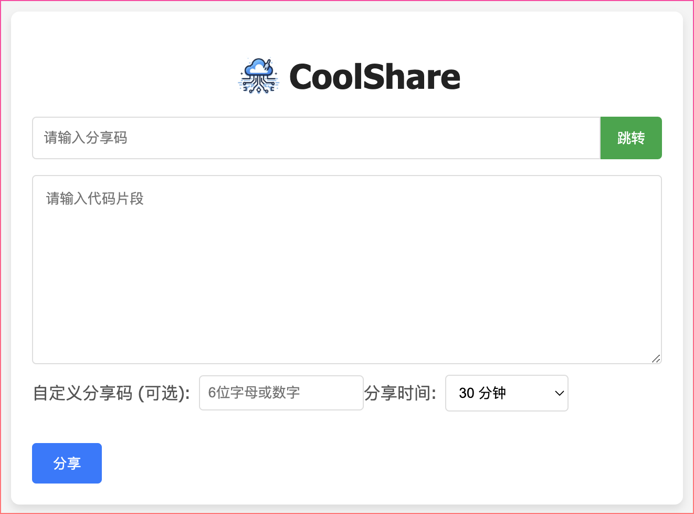
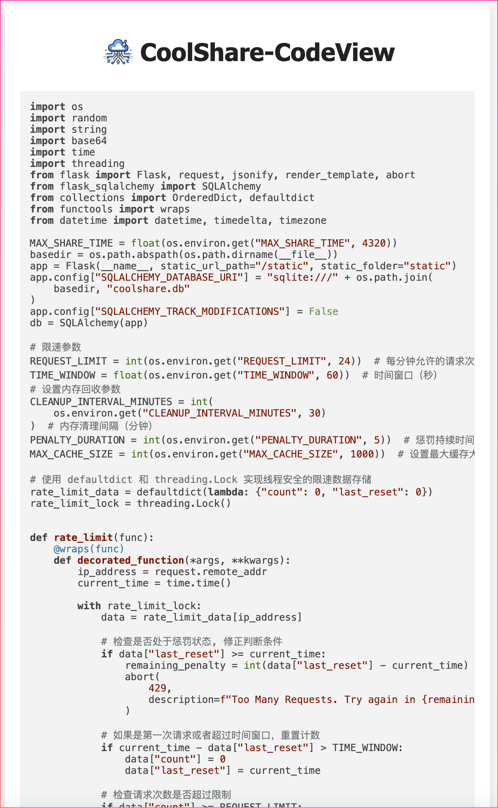

<p align="center">

</p>
<h1 align="center">
  CoolShare - 轻量级文本和代码片段管理分享工具
</h1>

<p align="center">
 <a href="docs/README.en.md">English</a> | <a href="README.md">简体中文</a>
</p>

<p align="center">
  <a href="https://github.com/s0w0h/coolshare/blob/main/LICENSE"></a>
  <a href="https://github.com/s0w0h/coolshare/pulls"></a>
</p>

## 简介

`CoolShare` 是一款轻量级、易用的文本和代码片段管理分享工具，旨在帮助个人和团队快速搭建内部代码协作共享平台。

## 特性

* **开箱即用**: 无需复杂配置，即可快速部署使用。
* **简单轻量**: 基于 Flask 框架，简洁易懂。
* **代码高亮**:  支持代码语法高亮显示，方便阅读。
* **分享期限**: 可设置代码片段的分享期限，到期自动失效。
* **访问限制**: 可配置请求频率限制，防止滥用。

## 项目结构

```
│  
├── app/
│   ├── app.py             # Flask 应用主文件
│   ├── templates/         # HTML 模板文件
│   │   ├── index.html     # 首页模板
│   │   ├── view.html      # 代码片段查看页面模板
│   ├── static/            # 静态资源文件
│   │   ├── style.css      # 样式文件
│   │   ├── script.js     # JavaScript 文件
├── readme.md              # 项目说明文档
├── requirements.txt       # Python 依赖库列表
├── Dockerfile            # Docker 构建文件
```

## Docker 部署

1. **暴露 5000 端口**
2. **持久化 `/app/coolshare.db` 数据库 (可选)**
3. **配置环境变量 (可选)**

**示例:**

```bash
# 基础部署
docker run -d --name coolshare --restart always -p 5000:5000 s0w0h/coolshare:latest

# 持久化数据库
docker run -d --name coolshare --restart always -p 5000:5000 -v ~/coolshare/db:/app/db s0w0h/coolshare:latest

# 配置环境变量
docker run -d --name coolshare --restart always -p 5000:5000 -v ~/coolshare/db:/app/db -e MAX_SHARE_TIME=100 s0w0h/coolshare:latest
```

## 环境变量

| 环境变量名               | 说明                                                          | 是否必须 | 默认值 |
| ------------------------ | ------------------------------------------------------------- | -------- | ------ |
| ACCESS_PASSWORD          | 主页及分享登录密码                                             | false    | None   |
| SECRET_KEY               | 用于初始化签名Session Cookie                                 | false    | 随机生成24位|
| MAX_SHARE_TIME           | 最长分享时间，单位分钟                                        | false    | 4320  |
| REQUEST_LIMIT            | 时间窗口内限制创建和删除总数量                                | false    | 24     |
| TIME_WINDOW              | 时间窗口，单位秒                                             | false    | 60     |
| CLEANUP_INTERVAL_MINUTES | 执行 IP 计数器和数据库清理任务定时，单位分钟                   | false    | 30     |
| PENALTY_DURATION         | 基础的惩罚时长，每次超过限制，惩罚时长翻倍，单位分钟            | false    | 5      |
| MAX_CACHE_SIZE           | 计数器最大缓存值                                               | false    | 1000   |

## 截图

| 首页 | 代码分享 | 代码查看 | 404 页面 |
|---|---|---|---|
|  |  |  |  |


## 许可协议

本项目采用 **GPLv3** 协议开源，详情请参阅 [LICENSE](LICENSE) 文件。
