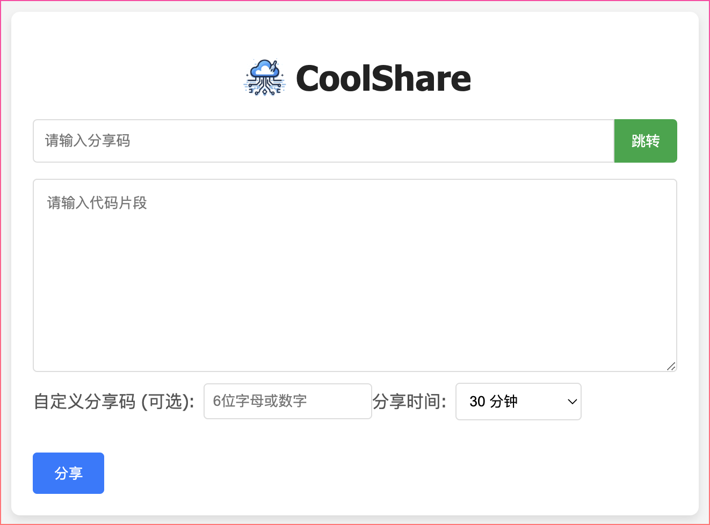
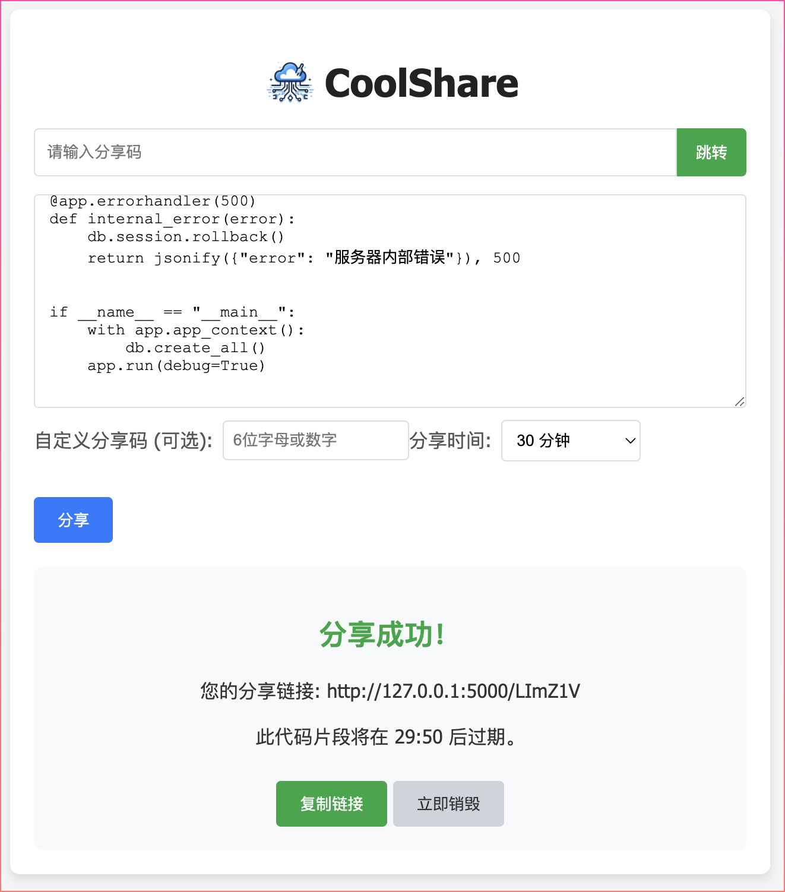
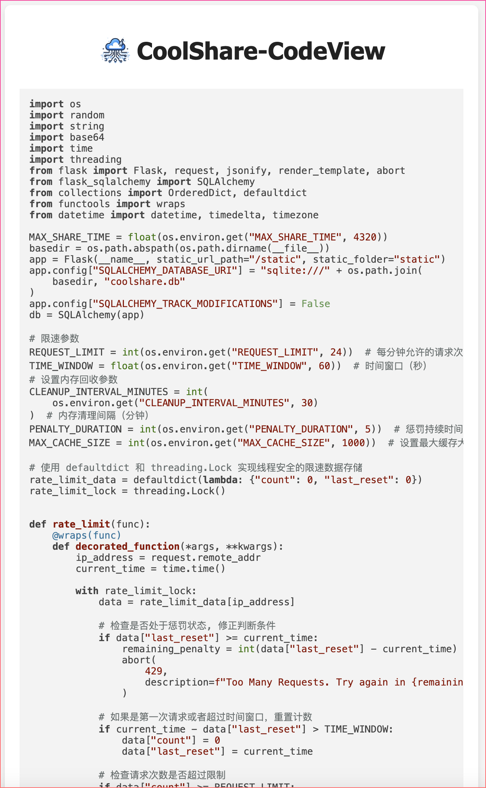
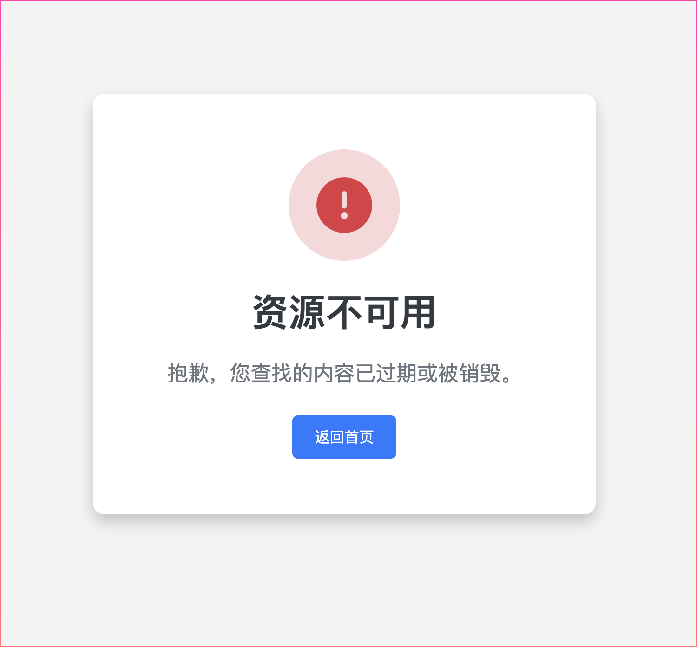

<p align="center">

</p>
<h1 align="center">
  CoolShare - Lightweight Text and code Snippet Sharing Tool
</h1>

<p align="center">
 <a href="../README.md">简体中文</a> | <a href="README.en.md">English</a>
</p>

<p align="center">
  <a href="https://github.com/s0w0h/coolshare/blob/main/LICENSE"></a>
  <a href="https://github.com/s0w0h/coolshare/pulls"></a>
</p>

## Introduction

`CoolShare` is a lightweight and easy-to-use Text and code snippet sharing tool designed to help individuals and teams quickly build an internal code collaboration and sharing platform.

## Features

* **Out-of-the-box**: No complicated configuration required, ready to deploy and use.
* **Simple and lightweight**: Based on the Flask framework, concise and easy to understand.
* **Code highlighting**: Supports code syntax highlighting for easy reading.
* **Sharing duration**: You can set the sharing duration of code snippets, which will automatically expire after the expiration date.
* **Access restriction**: Request frequency limits can be configured to prevent abuse.

## Project Structure

```
│  
├── app/
│   ├── app.py             # Flask application main file
│   ├── templates/         # HTML template files
│   │   ├── index.html     # Homepage template
│   │   ├── view.html      # Code snippet view page template
│   ├── static/            # Static resource files
│   │   ├── style.css      # Style file
│   │   ├── script.js     # JavaScript file
├── readme.md              # Project description document
├── requirements.txt       # Python dependency list
├── Dockerfile            # Docker build file
```

## Docker Deployment

1. **Expose port 5000**
2. **Persist `/app/coolshare.db` database (optional)**
3. **Configure environment variables (optional)**

**Example:**

```bash
# Basic deployment
docker run -d --name coolshare --restart always -p 5000:5000 s0w0h/coolshare:latest

# Persist database
docker run -d --name coolshare --restart always -p 5000:5000 -v ~/coolshare/db:/app/db s0w0h/coolshare:latest

# Configure environment variables
docker run -d --name coolshare --restart always -p 5000:5000 -v ~/coolshare/db:/app/db -e MAX_SHARE_TIME=100 s0w0h/coolshare:latest
```

## Environment Variables

| Environment Variable Name | Description                                                        | Required | Default Value |
| ------------------------ | ------------------------------------------------------------------ | -------- | ------ |
| ACCESS_PASSWORD          | Home & Share Login Password                                        | false    | None   |
| SECRET_KEY               | Used to initialize the Signature Session Cookie                    | false    | Randomly generate|
| MAX_SHARE_TIME           | Maximum sharing time, in minutes                                   | false    | 4320  |
| REQUEST_LIMIT            | Total number of creations and deletions allowed within the time window | false    | 24     |
| TIME_WINDOW              | Time window, in seconds                                            | false    | 60     |
| CLEANUP_INTERVAL_MINUTES | Timing for executing IP counter and database cleanup tasks, in minutes | false    | 30     |
| PENALTY_DURATION         | Basic penalty duration, doubled each time the limit is exceeded, in minutes | false    | 5      |
| MAX_CACHE_SIZE           | Maximum cache value for the counter                               | false    | 1000   |

## Screenshots

| Homepage | Code Sharing | Code Viewing | 404 Page |
|---|---|---|---|
|  |  |  |  |


## License

This project is open-sourced under the **GPLv3** license. For details, please refer to the [LICENSE](LICENSE) file.
```
